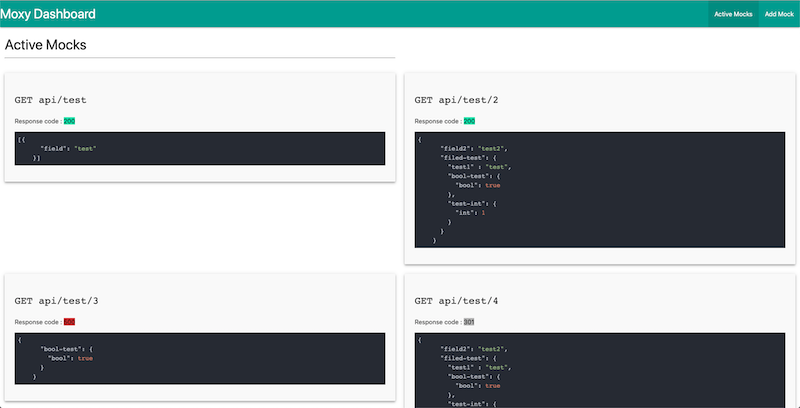
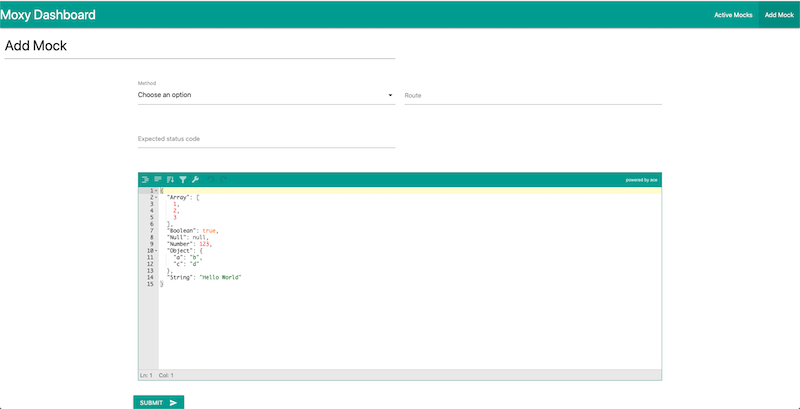

# Moxy

A proxy AND mock server.

Moxy helps you to mock api endpoint you need to be mocked and will proxy all other endpoint.

Moxy is designed for development purpose, it's a tool for developers. When working on a new feature, it maybe hard to work at the same time on the user interface (the frontend)
and the backend. Most of the time developers in a team tends to develop the backend first and the frontend later. But working this way introduce some inefficiency : when working on the frontend,
if the API contract isn't well design for the frontend implementation, it's too late to change it and it cost a lot.

Moxy helps backend and frontend developers to design APIs based on a common agreement, implement a mock and then, work at the same time on the frontend and the backend.

## How is it different from a mock server?

Moxy is not just a mock server. It's also a proxy. Moxy will mock only the endpoint you asked to be mocked. All other endpoints will be reach to the backend through the proxy (the real API).

## Example

You are working on a frontend application which consume 2 endpoints :

* `GET /myressources`
* `POST /myressources`

In order to test all case, you need the GET endpoint to return a specific value (null for example).

You can tell Moxy to mock the `GET /myressources` endpoint in order to get what you need or expect. All other endpoints will be called exactly as if 
you were calling them.

## Usage

### Running Moxy

```
moxy -backend=http://mydomain.com/api/ -proxy-port=8080
```

* The `backend` flag is mandatory.
* The `proxy-port` flag has a default value (8080).


### Docker usage

```sh
docker run -p 8080:8080 -it -e MOXY_BACKEND=http://mydomain/api/ seblegall/moxy
```

### Dashboard : list mocks, add a new mock

Moxy also provide a dashboard to help you create and list mock. By default, the Moxy dashboard can be reach on port `8181`.
But you can specify another one with the `-admin-port=` flag.


